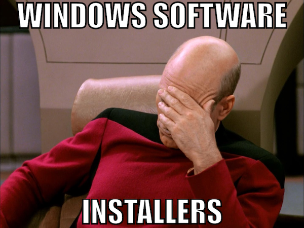
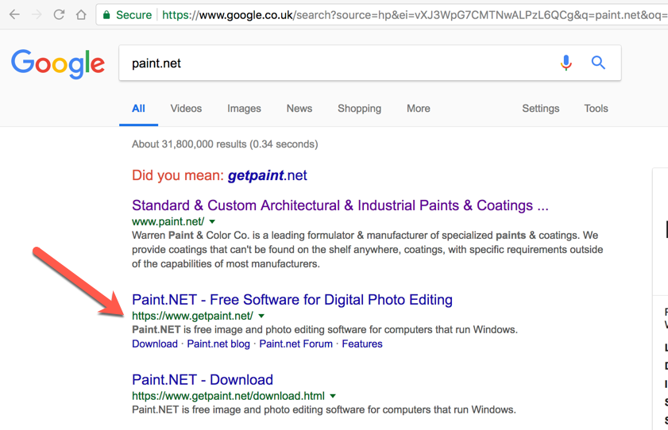
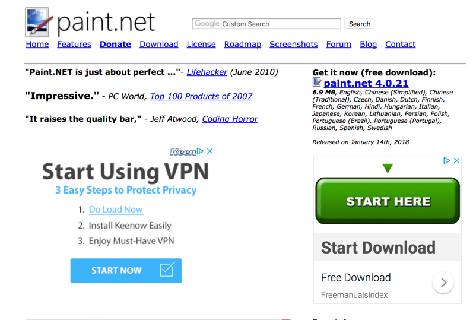
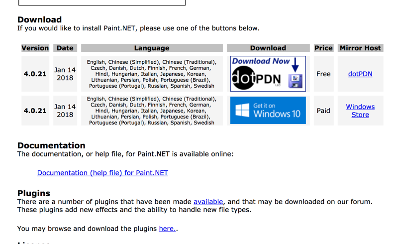
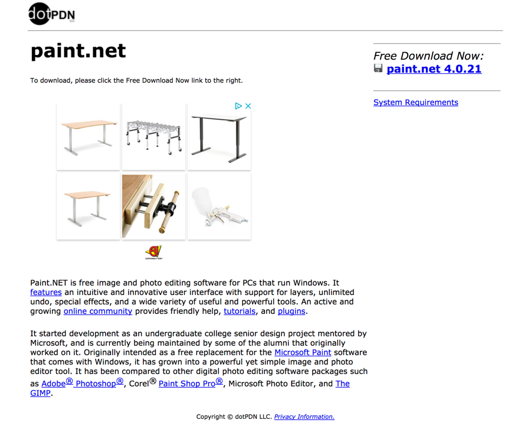
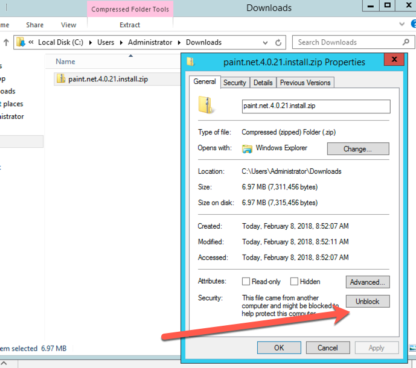
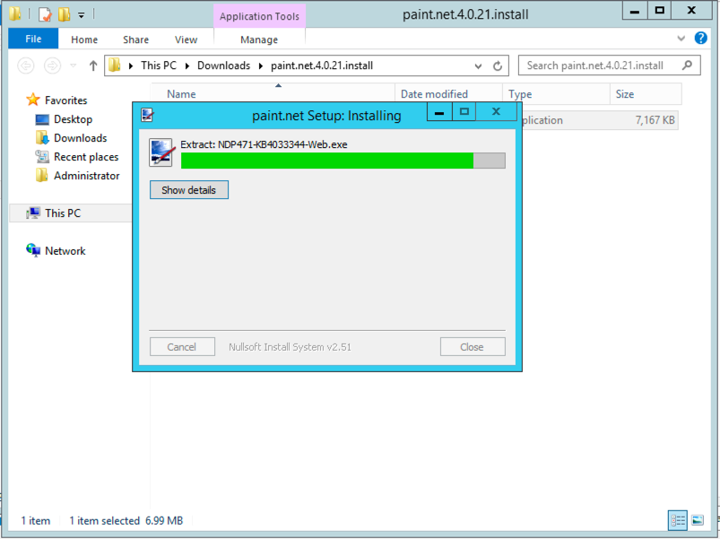
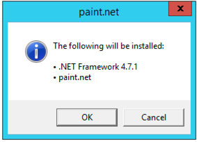

@title[Adding a layer of Chocolate(y)]

## Adding a layer of Chocolate(y)

---
@title[What is Chocolatey?]
## What is Chocolatey?

+++

@title[A Definition...]
### A Definition...

"Chocolatey NuGet is a Machine Package Manager, somewhat like apt-get, but built with Windows in mind."

---

@title[It's Magic!]
### It's Magic!

---

@title[Windows Software Installers]

---

@title[Let's install paint.net]
Let's install paint.net

+++

@title[Build Step]
Let's install paint.net

<!-- .slide: data-transition="none" -->

+++

@title[Build Step]
Let's install paint.net

<!-- .slide: data-transition="none" -->

+++

@title[Build Step]
Let's install paint.net

<!-- .slide: data-transition="none" -->

+++

@title[Build Step]
Let's install paint.net

<!-- .slide: data-transition="none" -->

+++

@title[Build Step]
Let's install paint.net

<!-- .slide: data-transition="none" -->

+++

@title[Build Step]
Let's install paint.net

<!-- .slide: data-transition="none" -->

+++

@title[Build Step]
Let's install paint.net

<!-- .slide: data-transition="none" -->

+++

@title[Build Step]
Let's install paint.net

<!-- .slide: data-transition="none" -->

+++

@title[Build Step]
Let's install paint.net

<!-- .slide: data-transition="none" -->

+++

@title[Build Step]
Let's install paint.net

<!-- .slide: data-transition="none" -->

+++

@title[Build Step]
Let's install paint.net

<!-- .slide: data-transition="none" -->

+++

@title[Build Step]
Let's install paint.net

<!-- .slide: data-transition="none" -->

---

@title[Source Code]
## Source Code
### http://gep13.me/ChocolateyDemos

---

@title[Demos]
## Demos

Note:
Mention laptop setup:

---

@title[Questions]
## Questions?

Feel free to get in touch

Email: gep13@gep13.co.uk

Twitter: @gep13

Web: http://www.gep13.co.uk

---

@title[Resources]
## Resources

* Chocolatey Documentation - https://chocolatey.org/docs
* Source Code - https://github.com/chocolatey/choco
* Learning Resources - https://chocolatey.org/docs/resources
