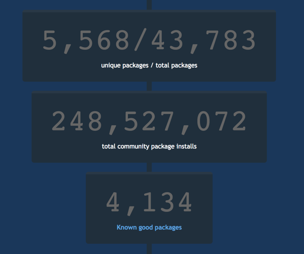

@title[Adding a layer of Chocolate(y)]

## Adding a layer of Chocolate(y)

---
@title[What is Chocolatey?]

## What is Chocolatey?

+++

@title[A Definition...]

### A Definition...

"Chocolatey is a global PowerShell execution engine using the NuGet packaging infrastructure. Think of it as the ultimate automation tool for Windows."

+++

@title[It's Magic!]

---

## Windows Software Ecosystem

+++

@title[Traditional Windows]

### Traditionally Windows was designed with Visual Interfaces (GUIs) in mind

+++

### There is no place more evident of that still than in the Windows Software Installer ecosystem

+++

@title[Windows Software Installers]

+++

### Windows Software Ecosystem

- Over 20 installer formats and thousands of installers in the wild |
- Zips and other archive formats |
- Software installers are messy |
- It's like the wild west |

+++

---

@title[Let's install paint.net]

## Let's install paint.net...

+++

@title[Build Step]

<!-- .slide: data-transition="none" -->

+++

@title[Build Step]

<!-- .slide: data-transition="none" -->

+++

@title[Build Step]

<!-- .slide: data-transition="none" -->

+++

@title[Build Step]

<!-- .slide: data-transition="none" -->

+++

@title[Build Step]

<!-- .slide: data-transition="none" -->

+++

@title[Build Step]

<!-- .slide: data-transition="none" -->

+++

@title[Build Step]

<!-- .slide: data-transition="none" -->

+++

@title[Build Step]

<!-- .slide: data-transition="none" -->

+++

@title[Build Step]

<!-- .slide: data-transition="none" -->

+++

@title[Build Step]

<!-- .slide: data-transition="none" -->

+++

@title[Build Step]

<!-- .slide: data-transition="none" -->

---

## "There has to be a better way!"

+++

---

@title[Build Step]

### Installation is easy...

<!-- .slide: data-transition="none" -->

---

### Chocolatey - Sane Software Management

- Easily manage the software lifecycle |
- Native installers, zips and binaries |
- PowerShell Module simplifies work |
- Packages are independent building blocks |
- Integrates with Configuration Management |
- Business Friendly Features |

---

### Chocolatey - The Approach

- Single, unifying interface - control the chaos |
- Decentralized - mulitple places to get packages, including internal |
- PowerShell |
- Flexible |
- Secure |
- Reliable |

---

### Community Package Repository

- https://chocolatey.org/packages |
- Community Feed / Community Maintained |
- Moderated as of October 2014 |
- Everything goes through VirusTotal |
- Organisations should NOT depend on this due to trust and control concerns |

+++

+++

### That is just the beginning...

---

### Hosting your own package server

- [https://chocolatey.org/docs/how-to-host-feed](https://chocolatey.org/docs/how-to-host-feed) |
- Non-Windows Hosting |
  - Artifactory |
  - Sonatype Nexus |
- NuGet Gallery |
- ProGet / MyGet |
- NuGet.Server / Chocolatey.Server |

---

### Chocolatey Packages

- Zip files + Versioning, Dependencies & PowerShell |
- Metadata Software Information / Package Information |
- PowerShell |
  - 30+ Built-in functions - turn hard tasks into one-liners |
  - Handle additional missing installer logic (like add to PATH) |
  - Add options missing from installer arguments |
- Files - drop in binaries / native installers |

---

@title[Source Code]

## Source Code

### http://gep13.me/ChocolateyDemos

---

@title[Demos]

## Demos

Note:
Mention laptop setup:

---

@title[Questions]

## Questions

Feel free to get in touch

Email: gep13@gep13.co.uk

Twitter: @gep13

Web: http://www.gep13.co.uk

---

@title[Resources]

## Resources

* Chocolatey Documentation - https://chocolatey.org/docs
* Source Code - https://github.com/chocolatey/choco
* Learning Resources - https://chocolatey.org/docs/resources
