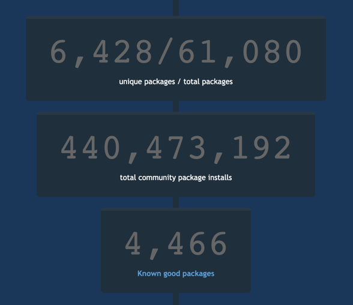

@title[Adding a layer of Chocolate(y)]

## Adding a layer of Chocolate(y)

---
@title[Slides and Code]

## Slides

### https://gep13.me/ChocoSlides

## Code

### https://gep13.me/ChocoCode

---

@title[What is Chocolatey?]

## What is Chocolatey?

+++

@title[A Definition...]

@quote[Chocolatey is a global PowerShell execution engine using the NuGet packaging infrastructure. Think of it as the ultimate automation tool for Windows.](Chocolatey Website)"

+++

@title[It's Magic!]

---

@title[Windows Software Ecosystem]

## Windows Software Ecosystem

+++

@title[Traditional Windows]

### Traditionally Windows was designed with Visual Interfaces in mind

+++

@title[Still evident]

### There is no place more evident of that still than in the Windows Software Installer ecosystem

+++

@title[Windows Software Installers]

+++

@title[No Consistency]

### No Consistency

- Over 20 installer formats and thousands of installers in the wild
- Zips and other archive formats
- Software installers are messy
- It's like the wild west

+++

@title[Wild West]

---

@title[Let's install paint.net]

## Let's install paint.net...

+++

@title[paint.net website]

<!-- .slide: data-transition="none" -->

+++

@title[Not the paint.net website]

<!-- .slide: data-transition="none" -->

+++

@title[Google paint.net]

<!-- .slide: data-transition="none" -->

+++

@title[Actual paint.net website]

<!-- .slide: data-transition="none" -->

+++

@title[paint.net download]

<!-- .slide: data-transition="none" -->

+++

@title[Mirror website]

<!-- .slide: data-transition="none" -->

+++

@title[Actual paint.net download]

<!-- .slide: data-transition="none" -->

+++

@title[Unblock zip file]

<!-- .slide: data-transition="none" -->

+++

@title[Extract zip file]

<!-- .slide: data-transition="none" -->

+++

@title[Install paint.net]

<!-- .slide: data-transition="none" -->

+++

@title[paint.net dependencies]

<!-- .slide: data-transition="none" -->

---

@title[There has to be a better way!]

## "There has to be a better way!"

+++

@title[Chocolatey]

---

@title[Installing is easy...]

### Installing is easy...

---

@title[Sane Software Management]

### Chocolatey - Sane Software Management

- Easily manage the software lifecycle
- Native installers, zips and binaries
- PowerShell Module simplifies work
- Packages are independent building blocks
- Integrates with Configuration Management
- Business Friendly Features

---

@title[The Approach]

### Chocolatey - The Approach

- Single, unifying interface - control the chaos
- Decentralized - mulitple places to get packages, including internal
- PowerShell
- Flexible
- Secure
- Reliable

---

@title[Community Package Repository]

### Community Package Repository

- [https://chocolatey.org/packages](https://chocolatey.org/packages)
- Community Feed / Community Maintained
- Moderated as of October 2014
- Everything goes through VirusTotal
- Organisations should NOT depend on this due to trust and control concerns

+++

@title[Community Repository Stats]

+++

@title[That is just the beginning...]

### That is just the beginning...

---

@title[Hosting your own package server]

### Hosting your own package server

- [https://chocolatey.org/docs/how-to-host-feed](https://chocolatey.org/docs/how-to-host-feed)
- Non-Windows Hosting
  - [Artifactory](https://youtu.be/rMivH0DS9q8)
  - [Sonatype Nexus](https://youtu.be/UehkG1VHtz0)
- NuGet Gallery
- ProGet / MyGet
- NuGet.Server / Chocolatey.Server

---

@title[Chocolatey Packages]

### Chocolatey Packages

- Zip files + Versioning, Dependencies & PowerShell
- Metadata Software Information / Package Information
- PowerShell
  - 30+ Built-in functions - turn hard tasks into one-liners
  - Handle additional missing installer logic (like add to PATH)
  - Add options missing from installer arguments
- Files - drop in binaries / native installers

---

@title[Slides and Code]

## Slides

### https://gep13.me/ChocoSlides

## Code

### https://gep13.me/ChocoCode

---

@title[Demos]

## Demos

Note:
Mention laptop setup:

---

@title[Only getting started...]

## Only getting started...

- choco upgrade all
- Package Downloader / Internalizer
- Sync with Programs and Features
- Self Service Installer
- Central Management UI / choco deploy
- Package Audit
- Package Reducer
- Install Directory Override
- Download CDN Cache
- Runtime Malware/Virus Protection

---?color=#7FDBFF
@title[Who Am I? - Gary Ewan Park]

@snap[north-west]
Who am I?
@snapend

@snap[west span-65]
Senior Software Engineer @ Chocolatey Software
 
 

@snapend

@snap[east span-30]

 

Gary Ewan Park

@snapend

@snap[south-west bio-contact]
@fa[twitter twitter-blue]&nbsp;&nbsp;gep13&nbsp;&nbsp;&nbsp;&nbsp;&nbsp;
@fa[github text-black]&nbsp;&nbsp;github.com/gep13&nbsp;&nbsp;&nbsp;&nbsp;&nbsp;
@fa[home text-blue]&nbsp;&nbsp;gep13.co.uk&nbsp;&nbsp;&nbsp;&nbsp;&nbsp;
@fa[envelope choco-blue]&nbsp;&nbsp;gary@chocolatey.io
@snapend

---

@title[Questions]

## Questions

Feel free to get in touch

Email: gep13@gep13.co.uk

Twitter: @gep13

Web: https://www.gep13.co.uk

---

@title[Resources]

## Resources

- Chocolatey Documentation - [https://chocolatey.org/docs](https://chocolatey.org/docs)
- Source Code - [https://github.com/chocolatey/choco](https://github.com/chocolatey/choco)
- Learning Resources - [https://chocolatey.org/docs/resources](https://chocolatey.org/docs/resources)
