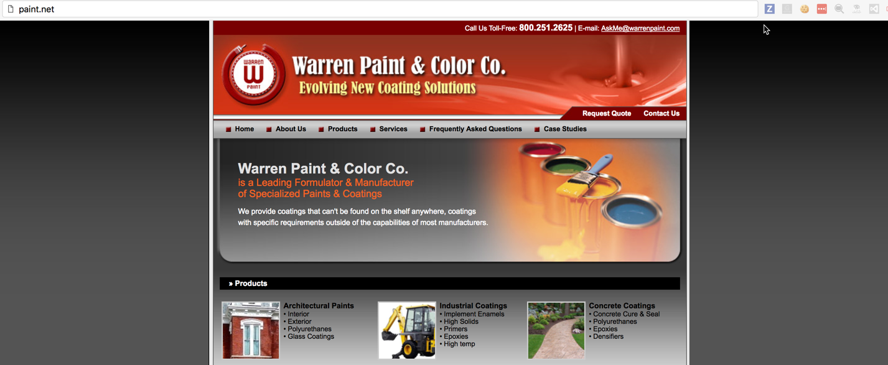

@title[Adding a layer of Chocolate(y)]

@snap[midpoint h3-blue span-100]
# Chocolatey
### Adding a layer
@snapend

---
@title[Slides and Code]

## Slides

#### https://gep13.me/ChocoSlides

@fa[plus-square fa-2x fa-pad-icon text-gold]

## Code

#### https://gep13.me/ChocoCode

---?color=linear-gradient(90deg, black 25%, white 25%)
@title[What is Chocolatey?]

@snap[west h1-white]
# Q
@snapend

@snap[east span-80]
#### What is
## @css[text-gold text-bold](Chocolatey )@fa[question]
@snapend

---?color=linear-gradient(90deg, #5289F7 25%, white 25%)
@title[Magic]

@snap[north-east text-05 text-gray]
Q. What is Chocolately?
@snapend

@snap[west h1-white]
#### A
@snapend

@snap[east span-70]
@quote[Chocolatey allows you to deploy any Windows software, anywhere, with anything, and manage and track that software over time.](Rob Reynolds - Creator of Chocolatey)"
@snapend

+++

#### Chocolatey is a package manager for Windows

+++

#### Similar to apt-get, yum, and Homebrew

+++

### With Chocolatey you can...

* Manage ANY software, not just installers
* Define dependencies
* Write a software deployment one time (with PowerShell)
* Test your deployment before deploying to Production
* Deploy to any supported version of Windows (including Server.Core and Docker Containers)
* Track and Report on software

+++?image=assets/img/magic.gif&size=45% auto&color=#A74433

@title[It's Magic!]

---?color=linear-gradient(90deg, black 25%, white 25%)
@title[What problem is Chocolatey trying to solve?]

@snap[west h1-white]
# Q
@snapend

@snap[east span-80 text-right]

#### What problem is Chocolatey
## @css[text-gold text-bold](trying to solve )@fa[question]

@snapend

---?color=linear-gradient(90deg, #5289F7 25%, white 25%)
@title[Windows Software Ecosystem]

@snap[north-east text-05 text-gray]
Q. What problem is Chocolately trying to solve?
@snapend

@snap[west h1-white]

# A

@snapend

@snap[east span-70]
## Windows Software Ecosystem
@snapend

+++

@title[Traditional Windows]

### Traditionally Windows was designed with Visual Interfaces in mind

+++

@title[Still evident]

### There is no place more evident of that still than in the Windows Software Installer ecosystem

+++?color=#8B1E26

@title[Windows Software Installers]

+++

@title[No Consistency]

### No Consistency

- Over 20 installer formats and thousands of installers in the wild
- Zips and other archive formats
- Software installers are messy
- It's like the wild west

+++?color=#261F1D

@title[Wild West]

---?color=linear-gradient(90deg, black 25%, white 25%)
@title[How does it work?]

@snap[west h1-white]

# Q

@snapend

@snap[east span-80]

#### How does Chocolatey
# @css[text-gold text-bold](work )@fa[question]

@snapend

---

@title[Let's install paint.net]

## Let's install paint.net...

+++

@title[paint.net website]

<!-- .slide: data-transition="none" -->

+++

@title[Not the paint.net website]

<!-- .slide: data-transition="none" -->

+++

@title[Google paint.net]

<!-- .slide: data-transition="none" -->

+++

@title[Actual paint.net website]

<!-- .slide: data-transition="none" -->

+++

@title[paint.net download]

<!-- .slide: data-transition="none" -->

+++

@title[Mirror website]

<!-- .slide: data-transition="none" -->

+++

@title[Actual paint.net download]

<!-- .slide: data-transition="none" -->

+++

@title[Unblock zip file]

<!-- .slide: data-transition="none" -->

+++

@title[Extract zip file]

<!-- .slide: data-transition="none" -->

+++

@title[Install paint.net]

<!-- .slide: data-transition="none" -->

+++

@title[paint.net dependencies]

<!-- .slide: data-transition="none" -->

+++

@title[There has to be a better way!]

## "There has to be a better way!"

+++

@title[Chocolatey]

---?color=linear-gradient(90deg, #5289F7 25%, white 25%)
@title[A series of simple commands]

@snap[north-east text-05 text-gray]
Q. How does Chocolately work?
@snapend

@snap[west h1-white]

# A

@snapend

@snap[east span-70]
## A series of simple commands
@snapend

+++

@code[powershell zoom-25](assets/files/cmds.ps1)

---

@title[Sane Software Management]

### Chocolatey - Sane Software Management

@ul[text-08](false)
* Easily manage the software lifecycle
* Native installers, zips and binaries
* PowerShell Module simplifies work
* Packages are independent building blocks
* Integrates with Configuration Management
* Business Friendly Features
@ulend

---

@title[The Approach]

### Chocolatey - The Approach

@ul[text-08](false)
* Single, unifying interface - control the chaos
* Decentralized - multiple places to get packages, including internal
* PowerShell
* Flexible
* Secure
* Reliable
@ulend

---

@title[Community Package Repository]

### Community Package Repository

@ul[text-08](false)
* [https://chocolatey.org/packages](https://chocolatey.org/packages)
* Community Feed / Community Maintained
* Moderated as of October 2014
* Everything goes through VirusTotal
* Organisations should NOT depend on this due to trust and control concerns
@ulend

+++

@title[Community Repository Stats]

+++

@title[That is just the beginning...]

### That is just the beginning...

---

@title[Hosting your own package server]

### Hosting your own package server

@ul[text-08](false)
* [https://chocolatey.org/docs/how-to-host-feed](https://chocolatey.org/docs/how-to-host-feed)
* Non-Windows Hosting
  * [Artifactory](https://youtu.be/rMivH0DS9q8)
  * [Sonatype Nexus](https://youtu.be/UehkG1VHtz0)
* NuGet Gallery
* ProGet / MyGet
* NuGet.Server / Chocolatey.Server
@ulend

---

@title[Chocolatey Packages]

### Chocolatey Packages

@ul[text-08](false)
* Zip files + Versioning, Dependencies & PowerShell
* Metadata Software Information / Package Information
* PowerShell
  * 30+ Built-in functions - turn hard tasks into one-liners
  * Handle additional missing installer logic (like add to PATH)
  * Add options missing from installer arguments
* Files - drop in binaries / native installers
@ulend

---
@title[Slides and Code]

## Slides

#### https://gep13.me/ChocoSlides

@fa[plus-square fa-2x fa-pad-icon text-gold]

## Code

#### https://gep13.me/ChocoCode

---?color=beige

@title[Demos]

## Demos

Note:
Mention laptop setup:

---

@title[Only getting started...]

## Only getting started...

@ul[text-08](false)
* choco upgrade all
* Package Downloader / Internalizer
* Sync with Programs and Features
* Self Service Installer
* Central Management UI / choco deploy
* Package Audit
* Package Reducer
* Install Directory Override
* Download CDN Cache
* Runtime Malware/Virus Protection
@ulend

---?color=#7FDBFF
@title[Who Am I? - Gary Ewan Park]

@snap[north-west]
#### Who am I?
@snapend

@snap[west span-65]
Senior Software Engineer @ Chocolatey Software
 
 

@snapend

@snap[east span-30]

 

Gary Ewan Park

@snapend

@snap[south-west bio-contact span-100]
@fa[twitter twitter-blue]&nbsp;&nbsp;gep13&nbsp;&nbsp;&nbsp;&nbsp;&nbsp;
@fa[github text-black]&nbsp;&nbsp;github.com/gep13&nbsp;&nbsp;&nbsp;&nbsp;&nbsp;
@fa[home text-blue]&nbsp;&nbsp;gep13.co.uk&nbsp;&nbsp;&nbsp;&nbsp;&nbsp;
@fa[envelope choco-blue]&nbsp;&nbsp;gary@chocolatey.io
@snapend

---

@title[Questions]

## Questions

Feel free to get in touch

Email: gary@chocolatey.io

Twitter: @gep13

Web: https://www.gep13.co.uk

---

@title[Learn More]

## Learn More

@ul[text-08](false)
* Chocolatey Documentation - [https://chocolatey.org/docs](https://chocolatey.org/docs)
* Source Code - [https://github.com/chocolatey/choco](https://github.com/chocolatey/choco)
* Learning Resources - [https://chocolatey.org/docs/resources](https://chocolatey.org/docs/resources)
@ulend
